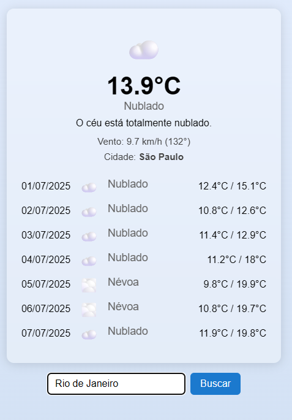
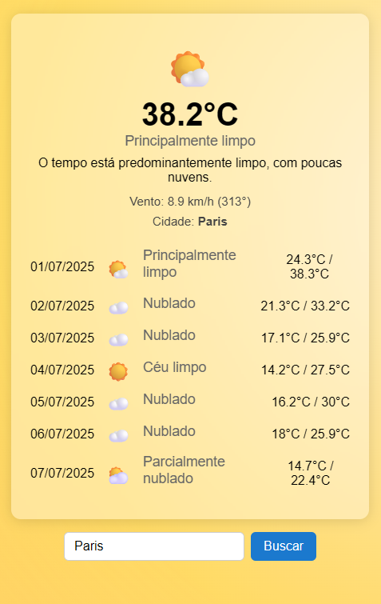
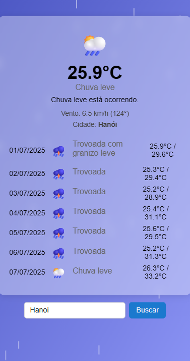

# Clima Now - Documentação do Projeto

## Descrição do App

O Clima Now é um aplicativo web moderno e responsivo para consulta do clima atual e previsão dos próximos dias de qualquer cidade do mundo. O usuário digita o nome da cidade, e o app exibe temperatura, condição do tempo, vento, previsão estendida, ícones e backgrounds animados conforme o clima, tudo em português e com visual adaptado para mobile e desktop.

## Funcionalidades Detalhadas

- **Busca de cidade:** O usuário pode pesquisar qualquer cidade do mundo. O app utiliza a API de geocodificação da Open-Meteo para obter latitude e longitude.
- **Exibição do clima atual:** Mostra temperatura, condição do tempo (ex: nublado, chuva, sol), vento e nome da cidade.
- **Previsão para vários dias:** Exibe previsão estendida com datas no formato brasileiro, ícones e descrições para cada dia.
- **Visual dinâmico:** O fundo da página muda conforme o clima (sol, nublado, chuva, neve, neblina, tempestade), com animação de gotas de chuva quando necessário.
- **Interface amigável:** Layout centralizado, responsivo, com textos e ícones em português do Brasil.
- **Acessibilidade:** O app pode ser navegado por teclado e é legível em diferentes tamanhos de tela.

---

## Captura de tela 1: Busca da cidade

---



---

## Captura de tela 2: Exibição do clima, etc

---



---

## Captura de tela 3: Animação baseada em cidades que estão chovendo

---



---

## Uso de IA no Projeto

Durante o desenvolvimento, utilizei IA para:

- Gerar trechos de código JavaScript e CSS modernos e responsivos.
- Refatorar funções para modularização e melhor manutenção.
- Resolver bugs de integração entre código de navegador e testes automatizados.
- Sugerir casos de teste, edge cases e boas práticas de segurança.
- Criar README, documentação e exemplos de testes automatizados.

## Reflexão: Aprendizados e Desafios

Aprendi a importância de separar funções puras de código de interface para facilitar testes e manutenção. O maior desafio foi garantir que o código funcionasse tanto no navegador quanto em ambiente de testes (Node), especialmente lidando com objetos como `window` e `document`. A IA foi fundamental para sugerir padrões de código compatíveis e para automatizar tarefas repetitivas.

## Orgulho

Tenho orgulho do visual moderno e da experiência fluida do app, especialmente da animação de chuva e do background dinâmico, que tornam o uso mais agradável e imersivo.

## O que melhoraria

Se tivesse mais tempo, implementaria:

- Autocompletar de cidades na busca.
- Opção de filtrar apenas cidades do Brasil.
- Mais opções de acessibilidade e temas visuais.
- Exibir também o país da cidade.

---

## Detalhes Técnicos Aprofundados

- **Frontend:** O app é inteiramente client-side, feito em HTML, CSS e JavaScript puro (ES6+), sem frameworks. O código é modularizado, com funções puras separadas para facilitar testes e manutenção.
- **Responsividade:** O layout utiliza Flexbox, media queries e unidades relativas para garantir boa experiência em diferentes tamanhos de tela.
- **Acessibilidade:** Elementos possuem contraste adequado, navegação por teclado e textos alternativos. O app é legível em dispositivos móveis e desktop.
- **Animações:** As animações de fundo e chuva são feitas via CSS e DOM, sem dependências externas.
- **Testes:** Uma branch chamada tests | Funções puras são testadas com Jest, garantindo confiabilidade dos cálculos e mapeamentos de clima.
- **Boas práticas:** Separação de responsabilidades, comentários explicativos e documentação detalhada.

## Explicação das APIs Utilizadas

- **Open-Meteo Geocoding API:**

  - Endpoint: `https://geocoding-api.open-meteo.com/v1/search`
  - Utilizada para converter o nome da cidade em latitude e longitude. Exemplo de chamada:
    ```
    https://geocoding-api.open-meteo.com/v1/search?name=São Paulo&count=1&language=pt&format=json
    ```
  - Retorna um array de resultados com nome, país, latitude e longitude.

- **Open-Meteo Weather API:**

  - Endpoint: `https://api.open-meteo.com/v1/forecast`
  - Utilizada para obter o clima atual e previsão estendida a partir das coordenadas. Exemplo de chamada:
    ```
    https://api.open-meteo.com/v1/forecast?latitude=-23.55&longitude=-46.63&current_weather=true
    ```
  - Parâmetros adicionais permitem obter previsão diária, códigos de condição do tempo, temperaturas mínimas/máximas, etc.
  - A resposta inclui códigos de condição do tempo (weathercode), temperatura, vento, etc.

- **Mapeamento de Weathercode:**
  - O app converte o código numérico retornado pela API em ícones, descrições curtas e formais em português, facilitando a compreensão pelo usuário.

## Arquitetura do Sistema

- **index.html:** Estrutura principal da página, inclui o formulário de busca e o container de exibição.
- **app.js:** Script de inicialização (opcional), pode ser usado para integração ou testes.
- **api/weather.js:** Contém toda a lógica de busca de dados, manipulação de DOM, animações e exibição do clima.
- **api/weather-utils.js:** Funções puras e utilitárias, como mapeamento de weathercode, para facilitar testes.
- **css/style.css:** Estilos, responsividade, backgrounds dinâmicos e animações.
- **assets/:** Ícones e imagens.
- \***\*tests**/:\*\* Testes automatizados das funções puras.
- **.gitignore:** Ignora arquivos desnecessários no versionamento.

O fluxo principal é:

1. Usuário digita a cidade e envia o formulário.
2. O app busca as coordenadas via Geocoding API.
3. Com as coordenadas, busca o clima atual e previsão via Weather API.
4. Os dados são processados, convertidos em ícones/textos amigáveis e exibidos.
5. O fundo e animações são atualizados conforme o clima.

---
