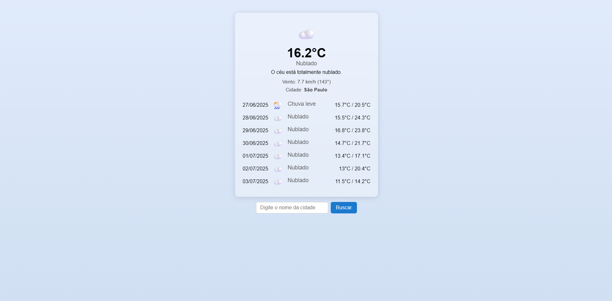

# Clima Now

Um aplicativo web moderno e responsivo para consultar o clima atual e previsão dos próximos dias de qualquer cidade, utilizando a API Open-Meteo. Visual amigável, com ícones, animações e backgrounds dinâmicos conforme o clima.

## Funcionalidades

- Busca de cidade com preenchimento automático.
- Exibe temperatura, condição do tempo, vento e descrição formal.
- Previsão para vários dias, com datas no formato brasileiro.
- Ícones e descrições em português do Brasil.
- Backgrounds animados e responsivos para cada tipo de clima (sol, nublado, chuva, neve, neblina, tempestade).
- Animação de gotas de chuva realista quando o clima for chuvoso.
- Visual moderno, responsivo e otimizado para mobile/tablet.

## Tecnologias Utilizadas

- HTML5
- CSS3 (Flexbox, Gradientes, Animações, Backdrop-filter)
- JavaScript (ES6+)
- API Open-Meteo (https://open-meteo.com/)

## Como Rodar Localmente

1. **Clone o repositório:**
   ```bash
   git clone <url-do-repositorio>
   ```
2. **Abra a pasta no VS Code ou outro editor.**

3. **Execute localmente:**

   - Basta abrir o arquivo `index.html` no seu navegador (não precisa de backend nem instalar dependências).
   - Se preferir, use uma extensão de servidor local como "Live Server" no VS Code para recarregamento automático.

4. **Pronto!**
   - Pesquise qualquer cidade e veja o clima e previsão animados.

## Estrutura do Projeto

```
├── index.html
├── app.js
├── api/
│   └── weather.js
├── css/
│   └── style.css
├── assets/
```

## Créditos

- Dados meteorológicos: [Open-Meteo](https://open-meteo.com/)
- Ícones: Unicode Emoji
- Animações e design: customizados

---

Sinta-se à vontade para contribuir, sugerir melhorias ou personalizar o visual!
